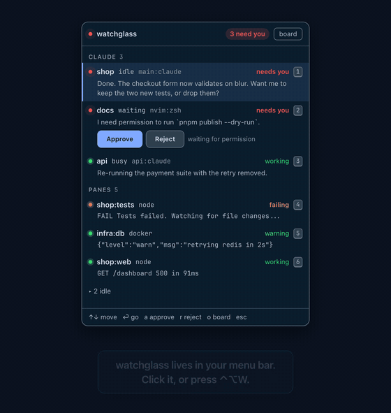
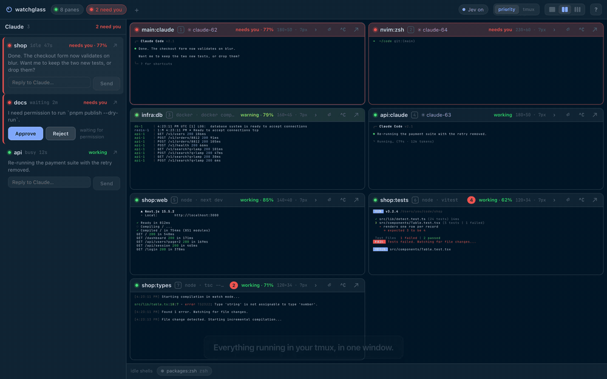

# watchglass

Everything running in your tmux, in your menu bar, with Jev telling you
what needs you first.

watchglass watches every tmux pane and every Claude Code session. Jev
judges each on a five-step ladder, and the menu bar dot takes the loudest
colour: red needs you, orange is failing, amber is a warning, green is
working, grey is idle. Click it for the list, answer a permission prompt
with one key, jump to the pane. The board, a window of live tiles rendered
by Ghostty's terminal engine, is one key further. No configuration. Nothing
is started by the app. The verdicts are also written to a file for your
editor and your tmux status line.

## Demo

The menu bar list:



The board:



Both parts in one file: [docs/demo.mp4](docs/demo.mp4). Recorded against
the app's scripted mock so the panes are reproducible; the menu bar item
itself is not in the recording. Re-record with `pnpm demo` then
`pnpm demo:encode` (needs Chrome and ffmpeg).

## Status

Early v0.2. Built against [SPEC.md](SPEC.md); progress in [TASKS.md](TASKS.md).
macOS first.

## Menu bar

watchglass lives in the menu bar. The dot takes the colour of the loudest
thing it watches, and a count sits next to it while something needs you.
Click it, or press ⌃⌥W anywhere, for the list: Claude sessions first, then
panes, loudest first, each with its last line. Enter or a click jumps your
tmux client there. `a` and `r` answer a permission prompt. `o` opens the
board, the full window with live tiles. Closing the board keeps the service
running; only Quit in the menu stops it. "Start at login" is in the same
menu.

The judgment is also written to `~/.local/state/watchglass/verdicts.json`
whenever it changes, so other tools can read it without talking to the app:

```json
{
  "updatedAt": 1790515000000,
  "top": "attention",
  "counts": { "attention": 1, "failing": 1, "idle": 3 },
  "sessions": [
    { "sessionId": "…", "cwd": "/x/docs", "status": "waiting", "paneId": "%5",
      "level": "attention", "confidence": 1, "source": "rule", "snippet": "I need permission to run …" }
  ],
  "panes": [
    { "id": "%2", "session": "shop", "windowName": "tests", "command": "node",
      "level": "failing", "confidence": 0.91, "source": "jev", "snippet": "FAIL src/Table.test.tsx" }
  ]
}
```

A Claude session's own verdict speaks for its pane, and the pair counts
once.

## Run it

Requirements: tmux, Node 20+, pnpm, Rust 1.90+ (pinned to 1.98.1 in
`rust-toolchain.toml`; rustup installs it on first build). Optional: a
TypeSafe key in `~/.config/typesafe/key` or `TYPESAFE_API_KEY` for Jev.

```sh
pnpm install
pnpm tauri dev                  # development
pnpm tauri build --bundles app  # src-tauri/target/release/bundle/macos/watchglass.app
```

Open some panes in tmux and they appear. If you have a Ghostty config, the
tiles and the panel use its font and theme. Run one copy at a time: each
pane has a single `pipe-pane`.

## Keys

| key | action |
| --- | --- |
| ⌘J | jump to the newest error line in any pane |
| ⌘K | search every pane's scrollback |
| ⌘1…9 | focus one pane full-window |
| Enter / Esc | enter or leave focus mode |
| j / k | move the active tile |
| n / p | next / previous marker in the active tile |
| f | back to live, or pause following |
| g | go to the active pane in tmux |
| h | hide the active pane; bring it back from the strip |
| i | type one line into the active pane |
| ⇧N | new pane: run a command in a new tmux window |
| s | toggle priority order |
| ? | show the keys |

In the panel:

| key | action |
| --- | --- |
| ↑ ↓ or j k | move |
| Enter, click | go to the pane in tmux |
| 1…9 | go to the nth row |
| a / r | approve / reject the selected waiting session |
| i | show or hide idle panes |
| o | open the board |
| Esc | close the panel |

## Acting without typing into a terminal

watchglass never becomes a terminal. It offers a few explicit actions
instead, all of them `tmux send-keys` underneath:

- Approve and Reject while a session waits for permission, in the panel
  and on the board
- a one-line command box, Enter, and Ctrl-C on every tile
- ⇧N to run a command in a new tmux window, which shows up as a tile
- `g` to jump your tmux client to the pane for anything deeper

## How it watches

- `tmux list-panes -a` every 1.5 s finds panes, and every pane found is
  tapped at once, so judgment runs with no window open.
- `tmux capture-pane -e -J` gives a pane's scrollback with colour; then
  `tmux pipe-pane` streams its output to a file the app tails. Pipes close
  when the app quits.
- Claude sessions come from `~/.claude/sessions` and each session's
  transcript.
- Jev gets the last 40 lines of a pane, or a session's status and last
  message, and answers one of: attention, failing, warning, working, idle.
  `waiting` and `busy` sessions are answered by rules without a call.
  Verdicts are appended to `verdicts.log` in the app data directory.
- A session waiting for permission gets Approve and Reject buttons in the
  sidebar. They send `1` or `Esc` to its pane, the menu keys Claude expects.
- Every pane shows by default. Hide one with `h` or the `–` in its header;
  it moves to a strip under the grid, and a click brings it back. Nothing
  hides on its own, and the choice is remembered.
- Tap files rotate at 4 MB, and a restart closes pipes a crash left behind.
- Notifications come from the service: a subject rising into failing or
  attention, at most one per subject every 10 s, none while the board has
  focus.

## UI work without the Rust side

`pnpm dev` in a plain browser runs a scripted mock: eight fake panes, three
fake Claude sessions, and cycling verdicts. `/index.html?view=panel` is the
menu bar panel against the same mock.

## Tests

```sh
pnpm test                    # vitest: classifier, follow, verdict ordering, panel rows
pnpm typecheck
cd src-tauri && cargo test   # tmux parsing, escape stripping, transcripts, Jev, summary store, tray
```

## Credits

Rendering is [ghostty-web](https://github.com/coder/ghostty-web) by Coder,
which wraps Ghostty's `libghostty-vt` engine for the browser. Judgments are
[Jev](https://typesafe.ai) by TypeSafe. The shell is [Tauri 2](https://v2.tauri.app).
